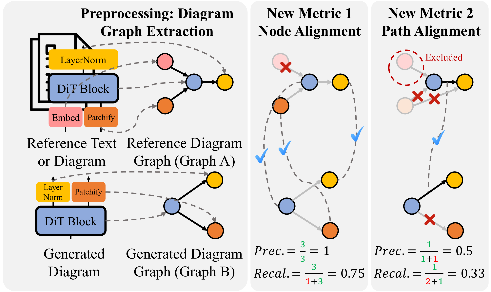

# [EMNLP 2025 Main] Diagram-Eval: Evaluating LLM-Generated Diagrams via Graphs

### [Paper](https://arxiv.org/abs/2510.25761) 

This repository contains the **official implementation** of our EMNLP 2025 Main paper:

> **Evaluating LLM-Generated Diagrams via Graphs**<br>
> Chumeng Liang, Jiaxuan You<br>
> University of Illinois Urbana-Champaign<br>

Diagrams play a central role in research papers for conveying ideas, yet they are often complex and labor-intensive to create. We propose **DiagramEval**, a novel evaluation metric designed to assess demonstration diagrams generated by LLMs. DiagramEval conceptualizes diagrams as graphs, treating text elements as nodes and their connections as directed edges, and evaluates diagram quality using two new groups of metrics: **node alignment** and **path alignment**.

<!-- insert an image here -->


## What's Included

This repository provides:

* **Diagram Data Collection**: Run **one command** to collect diagrams and paper context according to a list of paper titles. 
* **Diagram Generation (Demo)**: A demo LLM workflow to generate diagrams from paper context.
* **Diagram-Eval Metrics**: Our proposed metrics to evaluate generated diagrams against reference including paper context (.txt) and diagram images (.png).

## Environment Setup

### Dependency Installation

```bash
conda create -n diagram python=3.10
conda activate diagram
pip install -r requirements.txt
```

### API Key Configuration

Create `configs/key.yaml` with your API keys:
```yaml
openai_api_key: "your-openai-key"
google_api_key: "your-google-key"  # For Gemini image generation
claude_api_key: "your-claude-key"
gemini_api_key: "your-gemini-key"
nvidia_api_key: "your-nvidia-key"
```

## Quick Start

### 0. Prepare A Paper List

**Format:**
```json
[
  {
    "title": "Taming Transformers for High-Resolution Image Synthesis"
  },
  {
    "title": "Scalable Diffusion Models with Transformers"
  },
  ...
]
```

### 1. Collect Reference Data

**Run Our Data Collection Pipeline:**
```bash
python script/prepare_inputs.py \
  --paper-list [PATH_TO_PAPER_LIST] \
  --crawl-output [OUTPUT_DIR]/crawled \
  --extract-output [OUTPUT_DIR]/extracted \
  --config-path configs/llm_config.yaml
```

### 2. Generate Diagrams

**Basic generation:**
```bash
python script/generate_diagram.py \
  [PATH_TO_PAPER_CONTEXT] \
  --output-dir [OUTPUT_DIR]/generated
```

**With planning (focuses on methodology):**
```bash
python script/generate_diagram.py \
  [PATH_TO_PAPER_CONTEXT] \
  --output-dir [OUTPUT_DIR]/generated \
  --use-planner
```

### 3. Run Diagram-Eval

**Evaluate against reference:**
```bash
python script/evaluate_diagram.py \
  [PATH_TO_GENERATED_DIAGRAM_FILE] \
  [PATH_TO_REFERENCE_FILE] \  # .txt or .png
  --output-dir [OUTPUT_DIR]/generated
```

**Output:**
- `[OUTPUT_DIR]/generated/[ARXIV_ID]_metrics.json` - Evaluation metrics
- `[OUTPUT_DIR]/generated/[ARXIV_ID]_metrics.md` - Human-readable report

### 4. Check Output File Structure

**Output file structure:**
```
[OUTPUT_DIR]
├── crawled/
│   └── 2212.09748/
│       ├── 2212.09748.pdf: PDF file from Arxiv
│       └── 2212.09748.tar.gz: latex file package from Arxiv
├── extracted/
│   └── 2212.09748/
│       ├── 2212.09748_text.txt: reference paper context
│       └── 2212.09748_diagrams/
│           └── figure_overview.png: reference paper diagram
└── generated/
    ├── 2212.09748_generated_metrics.json: metric report in .json
    ├── 2212.09748_generated_metrics.md: metric report in .md
    └── 2212.09748_generated.png: generated diagram
```

Please check ['example/'](example/) for an example input and output file structure.

## Configuration

All LLM/MLLM configurations are managed in `configs/llm_config.yaml`:

- `text_graph_extraction`: Extract graph structure from text
- `image_graph_extraction`: Extract graph structure from diagram images
- `node_alignment`: Align nodes between generated and reference graphs
- `diagram_selection`: Select overview diagrams from papers
- `layout_planner`: Plan diagram layout and components
- `diagram_generator`: Generate diagrams via Google Gemini API

Modify model names, temperatures, and other parameters as needed.

## Evaluation Metrics

DiagramEval conceptualizes diagrams as directed graphs:
- **Nodes**: Text elements or components in the diagram
- **Edges**: Directional connections (arrows) between components

### Node Alignment
Measures how well the components in generated and reference diagrams correspond:
- **Precision**: Proportion of generated nodes that match reference nodes
- **Recall**: Proportion of reference nodes covered by generated nodes
- **F1 Score**: Harmonic mean of precision and recall

### Path Alignment
Evaluates the structural relationships between components:
- **Precision**: Proportion of generated paths that match reference paths
- **Recall**: Proportion of reference paths covered by generated paths
- **F1 Score**: Harmonic mean of precision and recall

## Advanced Usage Guidance

### Custom Prompt

Edit `evaluate_figure_captions` in `utils/extract_text_diagram_from_paper.py` to improve the diagram extraction accuracy.

Edit `_create_layout_plan` in `generate/workflow.py` to customize the planning prompt.

Edit `_request_diagram` in `generate/workflow.py` to customize the diagram generation prompt.


### Step-by-step data collection

Run `utils/crawl_paper.py` to only crawl latex files and PDF of the paper from Arxiv.

Run `utils/extract_text_diagram_from_paper.py` to manually pick diagrams from latex files.


<!-- ## Citation

If you use this code in your research, please cite:

```bibtex
@inproceedings{diagram-eval-2025,
  title={Evaluating LLM-Generated Diagrams via Graphs},
  author={Authors},
  booktitle={Proceedings of EMNLP},
  year={2025}
}
``` -->

## License

This project is licensed under the MIT License - see the [LICENSE](LICENSE) file for details.
